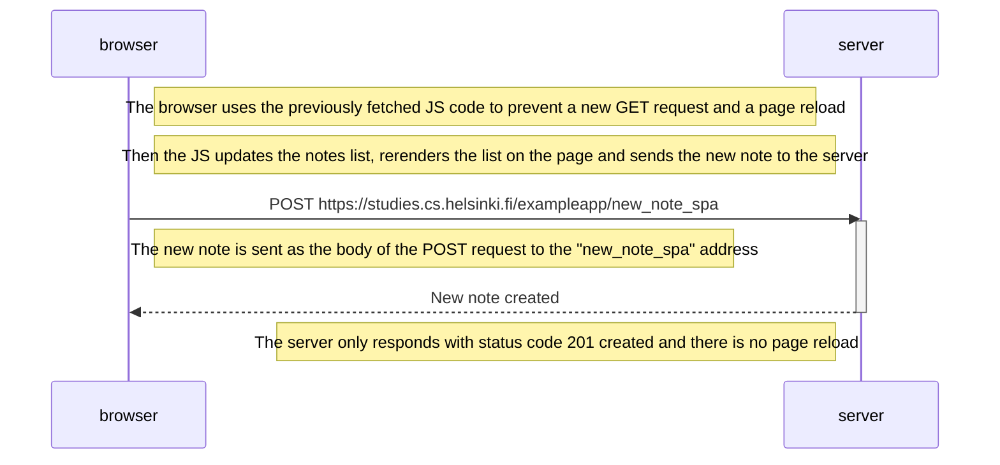

```mermaid
sequenceDiagram
    participant browser
    participant server

    Note right of browser: The browser uses the previously fetched JS code to prevent a new GET request and a page reload

    Note right of browser: Then the JS updates the notes list, rerenders the list on the page and sends the new note to the server
    
    browser->>server: POST https://studies.cs.helsinki.fi/exampleapp/new_note_spa
    activate server
        
    Note right of browser: The new note is sent as the body of the POST request to the "new_note_spa" address

    server-->>browser: New note created
    deactivate server

    Note left of server: The server only responds with status code 201 created and there is no page reload
```
